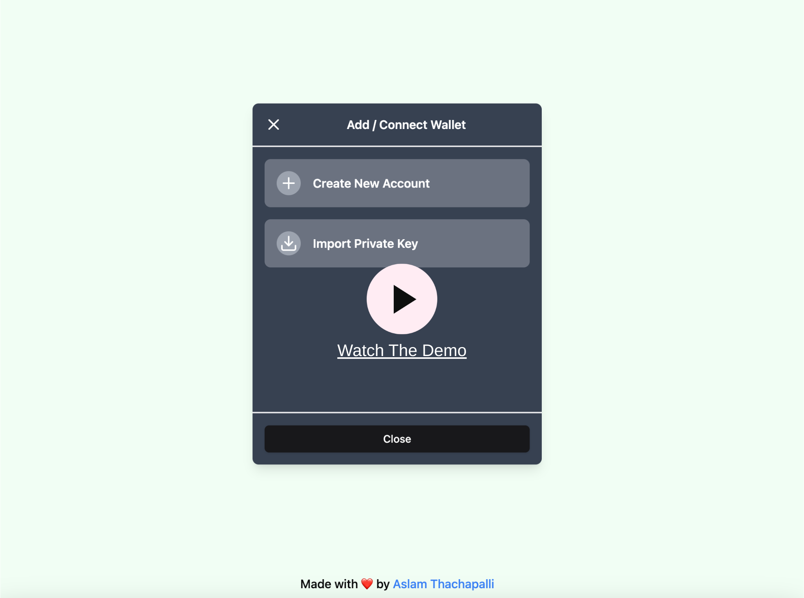

# Web3 Wallet

### Features

- Create new wallet using mnemonic generation.
- After Mnemonic is generated you can create HD wallets for Solana and Etherium.
- Import an existing wallet using private key. Currently only Solana chain is supported.
- You can view all your tokens from the imported Solana wallet if any.

### Watch Demo

#### Views

<table>
  <tr>
    <td></td>
    <td></td>
    <td></td>
  </tr>
  <tr>
    <td></td>
    <td></td>
    <td></td>
  </tr>
</table>

### Footer Note

- The application is currently using localstorage inorder to persist the wallet infos. And yes, it stores every info including private keys and seed in the localstorage 🫣
- The project is more for a learning purpose, so I hope this is pardonable at this stage.
